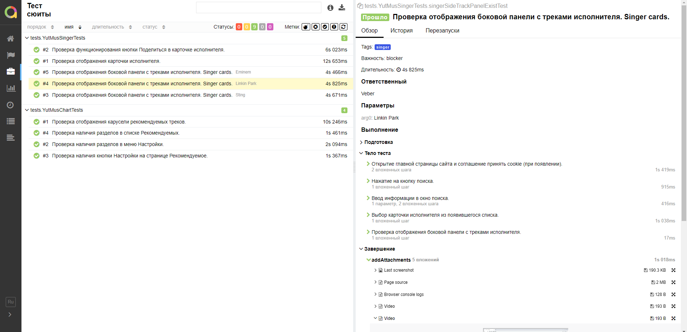
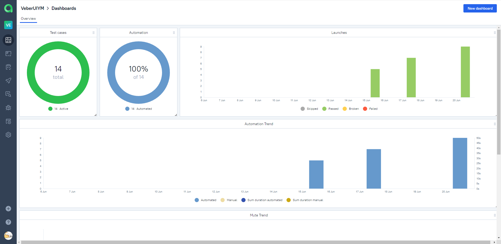
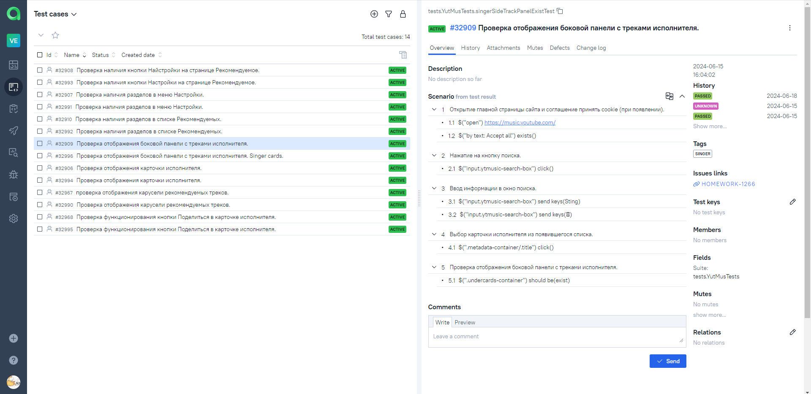

# Проект по автоматизации UI тестирования веб-сайта Music.Youtube

## Содержание:

- <a href="#tools"> Технологии и инструменты.</a>
- <a href="#checking"> Реализованные проверки.</a>
- <a href="#console"> Запуск тестов из терминала.</a>
- <a href="#jenkins"> Сборка в Jenkins.</a>
- <a href="#allureReport"> Allure - отчет.</a>
- <a href="#allure"> Интеграция с Allure TestOps.</a>
- <a href="#jira"> Задача в Jira с отображением тест-кейсов и запусками.</a>  
- <a href="#tg"> Уведомление о пройденных тестах в Telegram.</a>
- <a href="#selenoid"> Видео прохождения теста удаленно в Selenoid. </a>

---

## Технологии и инструменты:

Автотесты написаны на языке `Java` с использованием `JUnit 5`, `Selenide`. Сборщик проекта - `Gradle`. Для удаленного
запуска реализована задача в `Jenkins` с использованием удаленного сервера `Selenoid`.
По результатам выполнения тестов сформирован `Allure-отчет` и подробный отчёт отражен в `Telegram канале` при помощи
бота. Так же осуществлена интеграция с `Allure TestOps` и `Jira`.

---

## Реализованные проверки:

- Проверка отображения карточки исполнителя.
- Проверка отображения боковой панели с треками исполнителя.
- Проверка функционирования кнопки Поделиться в карточке исполнителя.
- Проверка отображения карусели рекомендуемых треков.
- Проверка наличия разделов в списке Рекомендуемых.
- Проверка наличия кнопки Найстройки на странице Рекомендуемое.
- Проверка наличия разделов в меню Настройки.

### Пример локального запуска тестов из терминала

`gradle clean test -DbaseUrl=https://music.youtube.com -DbrowserSize=1024x768 -Dbrowser=chrome`

---

## Сборка в <a target="_blank" href="https://jenkins.autotests.cloud/job/VeberUIDiplom/"> Jenkins </a>

Для запуска сборки необходимо перейти в раздел <code>Собрать с параметрами</code>, выбрать необходимые параметры и
нажать кнопку <code>Собрать</code>.

После выполнения сборки, в блоке История сборок напротив номера сборки появятся значки <code>Allure Report</code> и <code>Allure TestOps</code>, при клике на которые откроется страница с сформированным html-отчетом и тестовой документацией соответственно.

---

## [Allure](https://jenkins.autotests.cloud/job/VeberUIDiplom/8/allure/) отчет

### Главная страница отчета

### Тест-кейсы

---

## Интеграция с <a target="_blank" href="https://allure.autotests.cloud/project/4290/dashboards">Allure TestOps</a>

На *Dashboard* в <code>Allure TestOps</code> видна статистика количества тестов. Новые тесты, а так же результаты
прогона приходят по интеграции при каждом запуске сборки.

## Основная страница отчёта

  
  

  

## Пример тест-кейса

---

## Задача в [Jira](https://jira.autotests.cloud/projects/HOMEWORK/issues/HOMEWORK-1266).

Реализована интеграция <code>Allure TestOps</code> с <code>Jira</code>, в тикете отображается, какие тест-кейсы были
написаны в рамках задачи и результат их прогона.

### Задача в Jira

#### Содержание задачи

- Цель
- Задачи для выполнения
- Тест-кейсы из Allure TestOps
- Результат прогона тестов в Allure TestOps

---

## Уведомление о пройденных тестах в Telegram.

После завершения сборки, бот, созданный в <code>Telegram</code>, автоматически обрабатывает и отправляет сообщение с
отчетом
о прогоне тестов в специально настроенный чат.

### Уведомление из переписки с чат ботом

#### Содержание уведомления в Telegram

- Окружение
- Комментарий
- Длительность прохождения тестов
- Общее количество сценариев
- Процент прохождения тестов
- Ссылка на Allure отчет

---

## Видео прохождения теста удаленно в Selenoid.

---

[Наверх ⬆](#наверх)